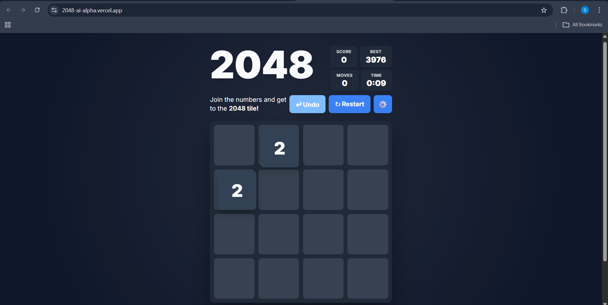
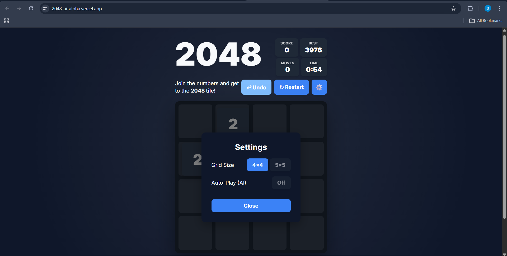
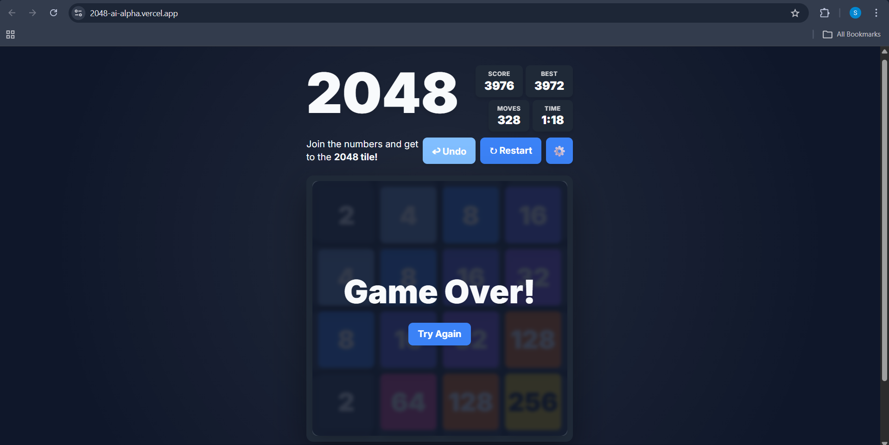

# 🧠 2048 AI – Modular Web Game with Auto-Play Engine


> A modular, production-grade implementation of 2048 featuring a heuristic-based AI auto-play engine, dynamic grid sizing, and responsive UI architecture.

A fully browser-native rebuild of the classic 2048 game with scalable architecture and clean state management.

---

## 🚀 Live Demo

[2048-ai-alpha.vercel.app](https://2048-ai-alpha.vercel.app/)

---

## 🎯 Features

- Smooth tile animations with merge detection
- Undo functionality
- Auto-Play AI mode
- Dynamic grid size (4×4 / 5×5)
- Persistent best score (localStorage)
- Move counter + session timer
- Modern dark theme UI
- Responsive design
- Keyboard + swipe support
- Settings modal

---

## 🧠 Architecture

```
js/
├── Game.js
├── AI.js
├── UI.js
├── InputManager.js
├── StorageManager.js
├── SoundManager.js
├── Constants.js
└── main.js
```

### Game Engine Flow

```
Input → Rotate Grid → Merge → Spawn Tile → Update UI → Check Game Over
```

### AI Logic

The AI evaluates possible moves based on:

- Empty cell count
- Merge opportunities
- Tile positioning weight
- Board smoothness

The best-scoring move is selected dynamically.

---

## 📸 Screenshots

### 1️⃣ Main Game Interface


### 2️⃣ Settings Panel (Grid Size + AI Toggle)


### 3️⃣ Game Over State


> Place your screenshots inside an `/assets` folder in the root directory.

---

## 🏗 Tech Stack

- Vanilla JavaScript (ES6 Modules)
- HTML5
- CSS3
- localStorage
- Vercel (Deployment)

No frameworks used.

---

## ⚙️ Local Setup

Clone the repository:

```bash
git clone [https://github.com/YOUR_USERNAME/2048-ai.git](https://github.com/Sankethhhhhhh/2048-AI.git)
cd 2048-AI
```

Run locally:

```bash
node server.js
```

Or use VS Code Live Server.

---

## 🌐 Deployment

Deployed via **Vercel** with automatic GitHub integration.

Every push to `main` triggers redeployment.

---

## 🛠 Key Learnings

- Implementing safe merge logic (prevent double merges)
- Designing heuristic-based AI without brute-force search
- Managing modular architecture without frameworks
- Responsive layout scaling for different grid sizes
- Clean state lifecycle handling

---

## 📈 Future Improvements

- Expectimax AI implementation
- Leaderboard integration
- Theme switcher
- PWA support
- Performance optimization for 5×5 AI

---

## 👨‍💻 Author

**Sanketh**  
AI/ML Student  
Focused on modular systems and interactive AI-driven applications.

---

## 📄 License

MIT License
